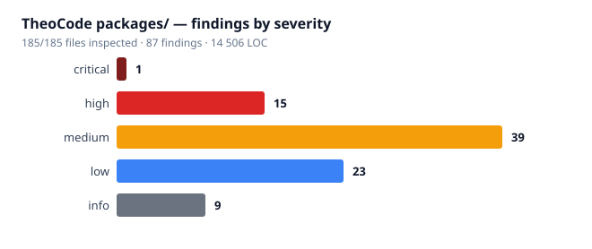

# Code review — TheoCode `packages/`

**Date:** 2026-08-08 · **Target:** 185 files, 14 506 LOC, 4 workspaces
**Coverage: 185 / 185 files inspected (100%)** — the engagement rule was that a missing file makes the review incomplete. It is satisfied by `SELECT`, not by assertion.
**Findings: 87** — 1 critical · 15 high · 39 medium · 23 low · 9 info

---

## The finding that matters most

**This codebase was reviewed on 2026-08-07 (98 findings), remediated, and merged the same day. Every item in `BACKLOG.md` is closed. Seven of those closed items have Definition-of-done bullets the code does not satisfy — and the single `critical` finding of this review is one of them.**

The old code is in decent shape. The defects are in the fixes.

| Item | Its own DoD bullet | What the code does |
|---|---|---|
| **B-005** `critical` | `assertPrivate()` refuses a group/world-writable consent store | It was placed in `trust-store.ts` `lerDocumento()`. `hook-trust.ts:74` declares its **own** `readStore()` on the **same file** with a bare `readFileSync` and no check. Directory trust is gated; the hook-approval set is not — and that is the set deciding which command lines reach `spawn(cmd, {shell:true, detached:true})` (`hook-runner.ts:39`). **B-005's own docstring names hook execution as the threat it defends.** `assertPrivate` is module-private, so the second consumer could not reuse it and duplicated the read instead. CWE-732. |
| **B-006** | "`resolveTrustPosture` reads the injected env, not ambient `process.env`" | The `env` parameter was added to the **private** `trustOrigin`; the only exported entry calls it with two args. All 10 production call sites read ambient env. `trust-posture.ts:109` |
| **B-007** | "the route forcing the file store does not discard variables beyond the intended ones" | `env: {}` still discards `THEOCODE_HOME` — the variable that *locates* that store. `git show 47eced3 --stat` proves the named fix commit never touched `credentials.ts`. |
| **B-012** | "`CursorNotDrainedError` observes what the SDK actually returns, or is removed" | Neither. `agent-list.ts:26` destructures only `r.items` and drops `nextCursor`, so the guard can never fire. **New consequence, unrecorded on 2026-08-07: this is a deletion path.** `resolverGuardas` builds its protection set from `listAgents`; if the SDK ever paginates, the set is page one and every agent beyond it loses its transcript. |
| **B-013** | its own docstring: "the two persistence calls" | There are **five**. Unprotected: `/new`, `/clear`, `/fork`, Esc-interrupt, backtrack confirm — `composition-root.ts:75, 84, 89` |
| **B-015** | "the working directory has a single, injected source" | `squad.ts:49` still calls `resolveToolScope(…, process.cwd())`, and `TeamContext` has no `cwd` field. A delegated worker is confined to the wrong tree. The TUI half was never done: 7 ambient re-reads, and `TuiRoot.initialPosture` — the seam built for it — has no reader. |
| **B-004** | "`assinar()` either supports multiple subscribers or is renamed to what it is" | Neither. And the test bearing that name **cannot fail** (below). |

### The mechanism

Three distinct routes let an unmet bullet pass as closed, and they are worth separating because they need different countermeasures:

1. **A sibling consumer the fix never reached.** B-005 and B-012 both fixed one call site and left an identical second one. `assertPrivate` being module-private is what *forced* the duplication — the fix's own encapsulation blocked its reuse.
2. **A `fixed_in` SHA that does not touch the cited file.** B-007 → `47eced3`, whose `--stat` lists `chat-acp.ts`, `chat-transport.ts`, `composition-root.ts`, `credential-helpers.ts` and the CHANGELOG — and no `credentials.ts`.
3. **A test that cannot fail, bearing the name of the guarantee.** B-004.

**Two cheap gates, in order of value:**
- Assert each BACKLOG item's `fixed_in` commit has a diff intersecting the paths in its own `evidence` field. Catches route 2 (B-007, B-015) at close time. ~30 minutes.
- When a fix adds a guard to a reader, grep for other readers of the same resource before closing. Catches route 1 — the route that produced the `critical`.

---

## The second theme: the deletion path fails open

`agent/session/gc` is the only code in the product that deletes user data, and five HIGH findings say the same thing in five places: **when it cannot tell, it decides "dead".**

| # | File | Failure |
|---|---|---|
| 70 | `liveness-oracle.ts:71` | The DFS `continue`s past any unreadable directory and returns `NAO_ACHOU` → `MORTO`. An `EACCES` on one ancestor makes a live project collectable. `classifyDirectory` **already has `INDETERMINADO`** for exactly this and uses it on one other branch only. |
| 71 | `gc/filesystem.ts:48` | `ehDiretorio` maps every `statSync` exception to `false` → `MORTO`. Distinguishing `ENOENT` from every other errno *is* the decision, and the `catch` discards it. |
| 72 | `gc/filesystem.ts:60` | A failed `stat` dates a real transcript to `mtimeMs = 0` — ~20 000 days old, clears every window, and sorts **last**, so `keepLast` (which slices the newest) cannot protect it either. The inline comment justifies this by assuming the only cause is ENOENT; `EACCES`/`EMFILE`/`ELOOP` leave the file on disk. |
| 69 | `gc/all-sessions.ts:93` | `resolverGuardas` returns an **empty** protection set for `MORTO` and applies `keepLast` only under `VIVO`. So `KEEP_PER_PROJECT` and `--keep-last` have no effect on precisely the projects the collector deletes from. Both tests force `VIVO` or `keepLast: 0` — the suite cannot see it. |
| 73 | `agent-list.ts:26` | Truncated registry → truncated protection set (above). |

Each alone is arguable. Together they are a **direction**: every unknown resolves toward deletion. This is the same fail-open class B-003 fixed for the pointer read — at four sites B-003 never looked at.

---

## Remaining HIGH findings

| # | File | Finding |
|---|---|---|
| 74 | `hooks/hooks.ts:381` | **Three security gates are optional parameters defaulting to open.** `approved?` undefined → every hook installed with no sha256 check (the gate B-008 exists to enforce); `hasLiveWriter?`/`readPointer?` make the apply-phase TOCTOU backstops opt-in; `resolveHeadlessApproval(policy, posture?)` returns `approved: true` for full-auto when `posture` is omitted, skipping the enforced-sandbox refusal that is its stated purpose. Callers pass them today — the defect is that the type permits the unsafe call and the default is the permissive branch. The sibling `OpcoesPlanoAll.hasLiveWriter` is **required**, which shows the right polarity was known. |
| 6 | `cli/src/runtime/args.ts:59` | **All five `USAGE` lines teach `theocode exec …`; the parser has no `exec` branch.** The token becomes the *prompt*. Following the CLI's own documentation fires a **billable model turn** instead of running `sessions gc` / `review` / `goal`. Reproduced: `exec sessions gc` → `mode=run, prompt="exec sessions gc"`. `README.md:32` has it right — the drift is in the text the user is shown. |
| 2 | `tui/formatting/tool-header.ts:11` | The `Blocked <cmd>` policy-veto rendering **can never fire** — three independent reasons: it bails on `'ok' in p` (every SDK result carries `ok`); it reads `p.exitCode` where results use `exit_code` (the sibling at `:189` gets it right); nothing produces exit 126. The hook veto path **does** fire, so the user loses the one signal built to tell them a hook blocked their tool. |
| 53 | `tui/backtrack/use-backtrack.ts:42` | **Esc-rewind is dead.** `primeBacktrack` calls `setRewindPrimed(true)` *before* `setRewindCount`/`setRewindPreviews`, so the ladder is built from unset state. Verified by execution: a probe returning 3 previews prints `{"armed":true,"nth":-1,"total":0,"previews":[]}`. The overlay returns `null` on the empty list; the second Esc emits `reset-backtrack`. Finding #30 inspected this same adapter and concluded the no-op was "harmless". |
| 24 | `tui/components/ConversationSlot.tsx:150` | Help panel documents `!` = "Run a shell command"; `ChatComposer` never receives `onShellCommand`, and the SDK gates the feature on it. `!npm test` is sent to the model as prose. The capability exists (`ptyOwner`, `run_shell`, `/ps`, `/stop`) — only the wiring is missing. |
| 1 | `tui/rendering/coalesced-memo.ts:11` | A docstring justifies an `export` by citing `test_the_clock_is_monotonic_non_decreasing` and `ADR-0023`. **Neither exists.** The comment pre-emptively disarms the dead-code detector, so the export survives on the strength of an artifact nobody checked. |

Notable MEDIUM: **#61** `stderr-guard.ts:17` — the guarded writer's `catch` is empty and returns `true` unconditionally. It is the *sole* output channel of the B-013 remediation, of hook-approval failures, and of the backtrack fork trace. On a non-writable cwd the TUI runs with every diagnostic dead and nothing says so. `shared/diagnostic-sink.ts:24-29` already solves this by falling back to stderr. **#75** `hook-runner.ts:80` settles on `exit` plus a bare 20 ms `setTimeout` rather than `close`; hook stdout *is* the decision channel, so a `block` can be silently downgraded to empty output. **#82** `review/parse.ts:56` — an unparseable reviewer response degrades to zero findings; a clean verdict and a parse failure produce identical structured data.

---

## Test audit

19 files, 90 tests, **all written during the same session as the code under review.**

`coverage_pct` is recorded **NULL, not estimated** — `@vitest/coverage-v8` fails to install (ERESOLVE), and a fabricated percentage is worse than an absent one because it is the number people quote.

The suite's weakest point is not coverage. It is that **two tests bear the name of a guarantee they do not encode**, and one **cannot fail**:

- **`ask-bridge.test.ts:95` — vacuous.** `test_a_second_subscriber_does_not_silently_replace_the_first` asserts `first.calls + second.calls > 0` and that `second` was called. Both hold **precisely when** the first subscriber *is* silently replaced. `first` is never asserted on. The comment directly above states the intent the assertions fail to encode.
- **`backtrack.test.ts:52` — weak.** `length > 0` where the contract is "you lose the partial line and nothing else". Should be `toBe(2)`.
- **`floor.test.ts` / `all-sessions.test.ts`** both force `VIVO` or `keepLast: 0`, which is why finding #69 — a retention flag with no effect on the deletion path — is invisible to a green suite.

A vacuous test is worse than a missing one: the missing test appears in the gate's output; the vacuous one reads as protection while the bullet it names goes unmet.

---

## What was measured, and what was rejected

**Rejected as evidence — `lizard`.** It reported 5 functions over CCN 15, including one at CCN 35 / 258 NLOC. All five are TypeScript misparses that merge sibling functions and class methods. Verified line by line: `sessionAndScreen` (claimed 58-320) ends at 113; `resolveDeclaredProvider` (claimed 186-271) is followed by another function at 207; `targetOf` (claimed 189-228) is a method whose claimed end is the end of the *class*. Cross-check: eslint enforces `complexity ≤ 10`, `max-lines-per-function ≤ 60`, `max-lines ≤ 400` across `packages/` and exits 0. Both cannot be true. Recorded in `tool_runs` so no phase treats those numbers as findings. **Zero complexity findings were filed** — not because complexity was skipped, but because neither reviewer could name a construct escaping the enforced ceilings.

**Rejected as findings — checked and discarded:**
- `consent-state.ts` — `trust()` increments `epoca`, `distrust()` does not. Looks like an asymmetry in a security transition; is correct. `epoca` only re-keys the `pendingHooks` memo, and `computePendingHooks` re-reads the posture from **disk**; `distrust()` rolls back state that never reached disk.
- `/goal pause` appearing to record `failed` — the SDK documents `abort()` as "not an error".
- `BacktrackOverlay.tsx`'s docstring claims about `windowFor` and `WindowView` — verified true against `@theokit/tui/dist/index.d.ts:1125-1129`.
- `Banner.test.tsx`'s `@theokit/tui@0.50.0` claim — installed is 0.50.2; harmless.
- `ConsentGates.tsx` re-deriving `process.cwd()` — filed **low**, not high: unlike `squad.ts` there is no injected value being bypassed. Latent, not active.

**Measured clean:** zero stubs across 12 916 LOC of production source (the single `TODO` hit is the Portuguese word "todo" inside a message); all 29 command names route; all 29 `CommandAction` kinds handled; all 15 `KeyAction` kinds have executors; 0 dependency cycles across 184 modules / 465 edges.

---

## Remediation, in order

| # | Item | Why first | Effort |
|---|---|---|---|
| 1 | **#68** — route `loadApprovedHooks` through the gated reader (export `assertPrivate`, or move both readers behind one). | The only `critical`; it un-gates the path that ends in `spawn(shell:true)`. | ~30m |
| 2 | **#69–73** — give the GC path an `INDETERMINADO` verdict on every swallowed `fs` error, and apply `keepLast` to `MORTO`. | Fail-open on irreversible data deletion. The vocabulary already exists. | ~2h |
| 3 | **#6** — `args.ts` `USAGE`. | Billable wrong behaviour on the documented path. | minutes |
| 4 | **#74** — make the three optional gates required. | Type-level permission to call unsafely; the sibling shows the right polarity. | ~30m |
| 5 | The six remaining unmet DoD bullets (B-004, B-006, B-007, B-012, B-013, B-015). | Each is small; the value is closing them for real. | ~1h |
| 6 | Fix the vacuous test **before** anything that relies on it. | It currently reports protection that does not exist. | minutes |
| 7 | The two BACKLOG gates in § The mechanism. | Prevents recurrence of both routes. | ~45m |
| 8 | **#2**, **#53**, **#24**, **#1**, **#61** — dead or half-wired features. Wire or delete; do not leave half-alive. | User-visible, non-destructive. | ~2h |

---

## What was NOT reviewed

- **Runtime behaviour, mostly.** Executed: `tsc`, `eslint`, `depcruise`, `vitest`, the CLI parser, the shipped bundle, and one scratch probe that proved #53 (created under `packages/tui/src/backtrack/` and deleted; `git status --porcelain` shows only the untracked `code-review-output/`). Everything else is proven by code reading.
- **Coverage percentages.** Tooling unavailable; not estimated.
- **Mutation testing.** Only two tests had detection power verified by mutation (`security-floor`, `interactive-shell-tool`); the other 17 did not.
- **`node_modules`, `dist`, `tools/`.** Outside the declared target.
- **The four `package.json` files** were read for contract claims, not audited as build configuration.
- **The SDK itself.** Findings cite `@theokit/*` `.d.ts` as ground truth for what TheoCode is entitled to; whether the SDK's own implementation honours those types was not checked.

---

## Provenance

`code-review-output/code-review.db` — 185 files inventoried, 30 components, 87 findings, 19 test-audit rows, 3 meetings, 1 tool run. Every finding carries `file`/`line` as structured columns plus an evidence snippet.

Scripts left in place so the numbers are reproducible: `inventory.py`, `components.py`, `dead-exports.py`, `test-audit.py`.
